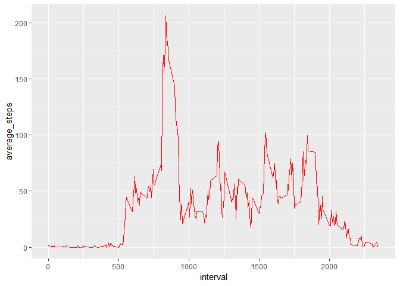
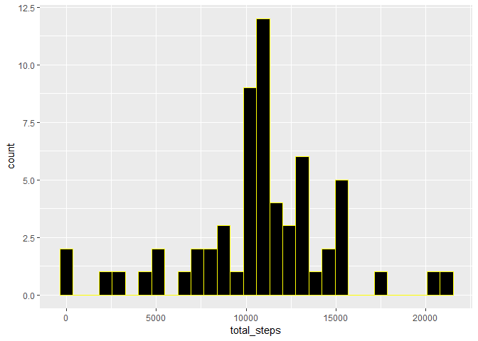
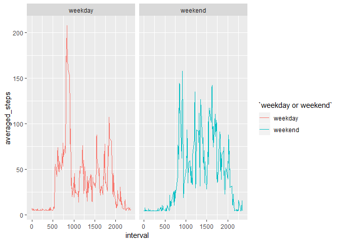

## Introduction


It is now possible to collect a large amount of data about personal movement using activity monitoring devices such as a Fitbit, Nike Fuelband, or Jawbone Up. These type of devices are part of the “quantified self” movement – a group of enthusiasts who take measurements about themselves regularly to improve their health, to find patterns in their behavior, or because they are tech geeks. But these data remain under-utilized both because the raw data are hard to obtain and there is a lack of statistical methods and software for processing and interpreting the data.

This assignment makes use of data from a personal activity monitoring device. This device collects data at 5 minute intervals through out the day. The data consists of two months of data from an anonymous individual collected during the months of October and November, 2012 and include the number of steps taken in 5 minute intervals each day.

The data for this assignment can be downloaded from the course web site:

* Dataset: [Activity monitoring data](https://d396qusza40orc.cloudfront.net/repdata%2Fdata%2Factivity.zip) 

The variables included in this dataset are:

steps: Number of steps taking in a 5-minute interval (missing values are coded as 𝙽𝙰) </br>
date: The date on which the measurement was taken in YYYY-MM-DD format </br>
interval: Identifier for the 5-minute interval in which measurement was taken </br>
The dataset is stored in a comma-separated-value (CSV) file and there are a total of 17,568 observations in this dataset. 


## Loading and preprocessing the data

1- unzip activity file to get csv file
2- read unzip file using read.csv()


```r
unzip_file <- unzip("activity.zip")
df <- read.csv(unzip_file)
```

## What is mean total number of steps taken per day?

1- group the data  by **date column** sum of **steps column** using **dplyr**  


```r
library(dplyr)
```

```
## 
## Attaching package: 'dplyr'
```

```
## The following objects are masked from 'package:stats':
## 
##     filter, lag
```

```
## The following objects are masked from 'package:base':
## 
##     intersect, setdiff, setequal, union
```

```r
df_group_by_date <- group_by(df , date)
df2 <- summarize(df_group_by_date , total_steps = sum(steps))
```

2- make a histogram using **ggplot2** to view the total number of steps taken each day


```r
library(ggplot2)
ggplot(df2 , aes(total_steps)) + geom_histogram(bins = 30 , fill="black" , color="yellow")
```

```
## Warning: Removed 8 rows containing non-finite values (stat_bin).
```

<!-- -->

3- compute the mean and the median


```r
mean_of_total_steps = mean(df2$total_steps,na.rm = T)
print(mean_of_total_steps)
```

```
## [1] 10766.19
```

```r
median_of_total_steps = median(df2$total_steps,na.rm = T)
print(median_of_total_steps)
```

```
## [1] 10765
```

## What is the average daily activity pattern?


1- group the data by **interval column** average of **steps column** using **dplyr**  


```r
df_group_by_interval <- group_by(df , interval)
df3 <- summarize(df_group_by_interval , average_steps = mean(steps,na.rm = T))
```

2- make a time series plot using **ggplot2**


```r
ggplot(df3 , aes(x = interval , y = average_steps)) + geom_line(color="red")
```

<!-- -->

3- Which 5-minute interval, on average across all the days in the dataset, contains the maximum number of step


```r
print( df3[df3$average_steps == max(df3$average_steps),])
```

```
## # A tibble: 1 x 2
##   interval average_steps
##      <int>         <dbl>
## 1      835          206.
```

## Imputing missing values

1-  Calculate and report the total number of missing values in the dataset


```r
print(nrow(df) - nrow(na.omit(df)))
```

```
## [1] 2304
```

2-  Devise a strategy for filling in all of the missing values in the dataset. The strategy does not need to be sophisticated. For example, you could use the mean/median for that day, or the mean for that 5-minute interval, etc.


```r
df[is.na(df$steps),"steps"] <- mean(df$steps , na.rm = T)
```

3-  Create a new dataset that is equal to the original dataset but with the missing data filled in.


```r
if(!file.exists("data")){
  dir.create("data")  
}

write.csv(df,"data/tidyData.csv")
```

4-  Make a histogram of the total number of steps taken each day and Calculate and report the mean and median total number of steps taken per day. Do these values differ from the estimates from the first part of the assignment? What is the impact of imputing missing data on the estimates of the total daily number of steps?


```r
df_group_by_date_tidy <- group_by(df , date)
df4 <- summarize(df_group_by_date_tidy , total_steps = sum(steps))

ggplot(df4 , aes(x=total_steps)) + geom_histogram(fill = "black" , color = "yellow")
```

```
## `stat_bin()` using `bins = 30`. Pick better value with `binwidth`.
```

<!-- -->


```r
print(mean(df4$total_steps))
```

```
## [1] 10766.19
```


```r
print(median(df4$total_steps))
```

```
## [1] 10766.19
```

Types of Estimate -:


First Part (with na) | 10766.19 | 10765


Second Part (fillin in na with mean) | 10766.19 | 10766.19


## Are there differences in activity patterns between weekdays and weekends?


For this part the weekdays() function may be of some help here. Use the dataset with the filled-in missing values for this part.

1-  Create a new factor variable in the dataset with two levels -- "weekday" and "weekend" indicating whether a given date is a weekday or weekend day.


```r
 df <- data.table::fread("data/tidydata.csv",drop = 1)
 
 df[,'date':=as.POSIXct(date,format="%Y-%m-%d")]
 
 df[,'Day':=weekdays(date)]                         
 
 df[grepl(pattern = "Monday|Tuesday|Wednesday|Thursday|Friday", Day), "weekday or weekend"] <- "weekday"
 
 df[grepl(pattern = "Saturday|Sunday", Day ), "weekday or weekend"] <- "weekend"
```

2-  Make a panel plot containing a time series plot (i.e. type = "l") of the 5-minute interval (x-axis) and the average number of steps taken, averaged across all weekday days or weekend days (y-axis). The plot should look something like the following, which was created using simulated data:


```r
df_group <- group_by(df,interval,`weekday or weekend`)
df5 <- summarise(df_group , averaged_steps = mean(steps))
ggplot(df5 , aes(x=interval,y=averaged_steps)) + geom_line(aes(color=`weekday or weekend`)) + facet_grid(. ~ `weekday or weekend`)
```

<!-- -->

